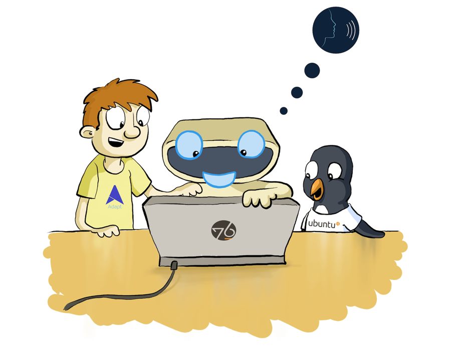

#### The Code

There are many ways to get involved in the Adapt project, you can check our [code repository on GitHub](https://github.com/MycroftAI/adapt) to contribute to the project itself, fork the project, and create pull requests.

#### The Community

You can engage with the Mycroft Community, the community supporting the project [on our community forums](https://community.mycroft.ai) or you can join us in our IRC channel, [#mycroft on Freenode](https://mycroft.ai/chat).

